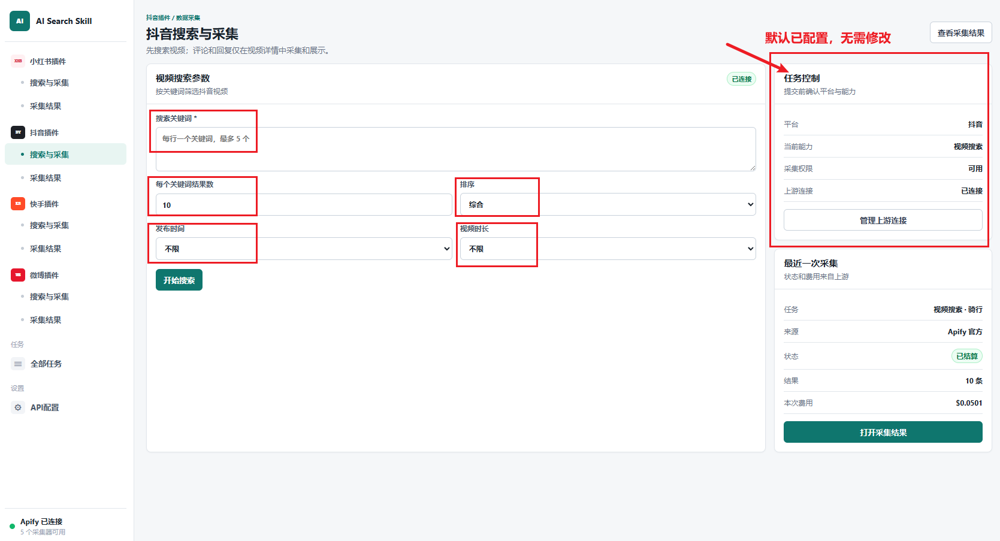
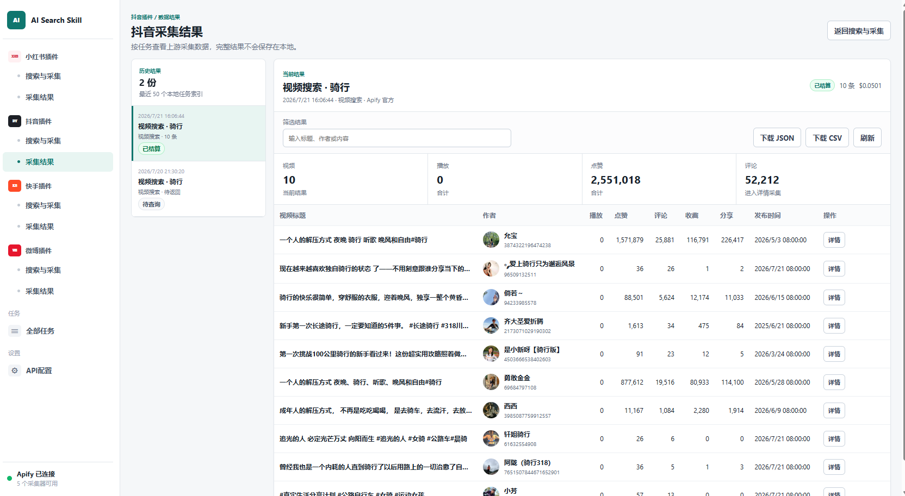
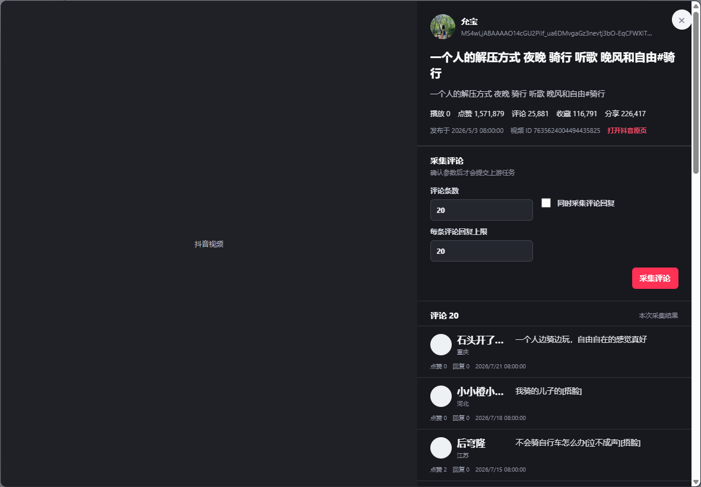

# AI_Search_Tools

## 项目介绍

AI_Search_Tools 是本地 AI Skill 客户端，提供无登录网页和统一 CLI，用于执行小红书、抖音、快手与微博内容搜索和采集任务。

项目仅直连 Apify 官方 API。客户端不提供账号、钱包、API 令牌管理、计费聚合或本地数据中心。

## 项目架构

```text
AI / CLI ─┐                                      ┌─ Apify 官方 API ─ Actor Run / Dataset
          ├─ platform_skill.py（127.0.0.1）─────┤
浏览器 ───┘                                      └─
```

浏览器 `localStorage` 保存最近 50 个任务的索引及结果 JSON 缓存；重新打开时会先读取本地缓存，再通过 Apify 官方 API 同步任务状态和结果。

已完成任务的完整结果还会写入项目内的 `outputs/task-results/<任务ID>.json`。当前项目对应的绝对目录是 `C:\Users\zhongjinlin\Desktop\ai_search_tools\outputs\task-results\`。该目录不进入 Git，适合本地归档和重启服务后的结果留存。

## 接口与 Actor 调用链

当前版本不直接调用小红书、抖音、快手或微博官方接口，也没有启用 AI-Search-Platform 网关。网页和 Skills CLI 都先进入本地代理，再由本地代理使用 Apify Token 调用 Apify 官方 API。

```text
本地网页 / Skills CLI
  -> http://127.0.0.1:8790/api/client/*
  -> https://api.apify.com/v2/*
  -> 对应平台 Actor Run
  -> Run 状态轮询
  -> 默认 Dataset 结果
  -> 浏览器结果视图 + outputs/task-results/<任务ID>.json
```

### 本地代理接口

| 方法与路径 | 用途 |
|---|---|
| `GET /api/client/config` | 返回脱敏配置和连接状态 |
| `POST /api/client/config` | 将 Apify Token 保存到被 Git 忽略的本地配置 |
| `GET /api/client/actors` | 通过 Apify `/users/me` 验证 Token，并返回内置 Actor 目录 |
| `POST /api/client/tasks` | 校验 Actor 与 operation 后提交采集任务 |
| `GET /api/client/tasks/{task_id}` | 查询并规范化 Apify Run 状态 |
| `GET /api/client/tasks/{task_id}/results` | 读取默认 Dataset，并保存完整结果 JSON |
| `GET /api/client/media?url=...` | 受限代理各平台已知 CDN 图片，不向浏览器暴露凭据 |

### Apify 官方接口

| 方法与路径 | 调用时机 |
|---|---|
| `GET /users/me` | 验证 Apify Token |
| `POST /acts/{actor_id}/runs` | 创建 Actor Run |
| `GET /actor-runs/{run_id}` | 轮询任务状态和读取 Dataset ID |
| `GET /datasets/{dataset_id}/items?clean=true&format=json` | 读取已完成任务结果 |
| `GET /key-value-stores/{store_id}/records/OUTPUT` | Run 失败且状态信息不足时补充读取错误原因 |

所有 Apify 请求使用 `Authorization: Bearer <Apify Token>`。README、Git 和 Obsidian 不保存 Token 实际值。

### 平台 Actor 与 operation

| 平台 | Actor ID | 客户端 operation |
|---|---|---|
| 小红书 | `sUXx8U35FLlaweCWO` | `search_notes`、`search_hot_list`、`get_note_detail`、`get_user_info`、`list_user_notes`、`get_note_comments`、`get_note_sub_comments` |
| 抖音搜索 | `3TJaaOJDU1AMiOoJM` | `douyin_search_videos` |
| 抖音评论 | `KmxOUB02ZqH7jxj07` | `douyin_fetch_comments`，通过 `includeReplies` 和 `maxRepliesPerComment` 控制回复采集 |
| 快手 | `W0cFcwuH7hhObmnwT` | `kuaishou_search_videos`、`kuaishou_get_video_detail`、`kuaishou_get_video_comments`、`kuaishou_get_comment_replies`、`kuaishou_get_user_info`、`kuaishou_list_user_videos` |
| 微博 | `2LERepIog9VIQCmN6` | `weibo_search_posts`、`weibo_search_hot_list`、`weibo_get_post_detail`、`weibo_get_user_info`、`weibo_list_user_posts`、`weibo_get_post_comments`、`weibo_get_post_comment_replies`、`weibo_list_post_likers`、`weibo_list_post_reposts` |

小红书 operation 原样传给 Actor；微博提交前移除 `weibo_` 前缀；快手会把统一字段 `video_id`、`video_url` 转换为 Actor 使用的 `photo_id`、`url`，并将回复 operation 转换为 `get_video_sub_comments`。抖音搜索和评论使用两套 Actor 输入，其中回复属于评论任务参数，不是独立 operation。

## 功能

- 小红书：独立的“搜索与采集”和“采集结果”页面，覆盖笔记、热榜、博主、评论和回复。
- 小红书笔记结果中的评论数字可打开评论详情弹窗，并在确认数量后发起评论或回复采集。
- 四个平台的评论和回复都只在对应内容详情弹窗中采集和展示，不进入平台采集结果历史或“全部任务”。
- 抖音：独立的视频搜索、评论采集和中文结果页面，支持视频筛选、批量评论及可选回复。
- 微博：覆盖微博搜索、热搜、详情、用户微博、评论回复、点赞用户和转发列表，共 9 项能力。
- 快手：支持关键词视频搜索、视频详情、一级评论、二级回复、博主资料与博主作品；评论与回复分成独立任务，官方模式使用 Actor `W0cFcwuH7hhObmnwT`。
- 任务：状态轮询、提供方标记、单任务费用、结果表格、详情、JSON 和 CSV 下载。
- 连接：本机保存 Apify Token，浏览器只访问回环代理并且只能看到 Token 掩码。
- CLI：与网页共用配置、operation 和双适配器调用逻辑。

## Skills使用参考

### 安装skills

将skills插件链接给到你的AI Agents，让其进行安装，如下地址：

```
https://it-gitlab.xmfunny.com/zhongjinlin/ai_search_tools
```

安装完成后，AI会提示启动服务和web前端页面，启动后复制链接在浏览器打开：

```
http://127.0.0.1:8790/
```

### Web页面使用参考

搜索的关键词，可以自行按需选择及填写，参考如下：

【搜索关键词】：露营

【数量】：10条

【排序】：热门/综合/最新

【发布时间】：按需

【视频时长】：按需



### 采集结果

点击【标题名称】，可以打开详情页，在详情页，点击【采集评论 或回复】的条目输入，完成该条视频的评论和回复展示。




### 采集结果显示



## 手动快速开始

要求 Python 3.10 或更高版本，不需要安装第三方 Python 包。

```powershell
python scripts/platform_skill.py serve --port 8790 --open-browser
```

固定访问地址为 `http://127.0.0.1:8790`。不要使用 `--port 0` 或其他端口：浏览器的本地任务与结果缓存按端口隔离，切换端口会让历史结果不可见。在“API配置”页填写 Apify API Token，官方地址固定为 `https://api.apify.com/v2`。

主要页面：

- `/xiaohongshu/search`、`/xiaohongshu/results`
- `/douyin/search`、`/douyin/results`
- `/kuaishou/search`、`/kuaishou/results`
- `/weibo/search`、`/weibo/results`
- `/tasks`、`/config`

官方模式内置当前四个平台的 Actor 目录，并通过 Apify `/users/me` 验证 Token。微博 Actor 为 `2LERepIog9VIQCmN6`，快手 Actor 为 `W0cFcwuH7hhObmnwT`；实际权限和费用以 Apify 账户为准。

微博关键词搜索示例（第一页不要传页码）：

```json
{
  "keyword": "人工智能",
  "max_items": 5,
  "auto_paginate": true,
  "page_token": ""
}
```

`page_token` 是上游返回的分页令牌，不是页码。第一页必须留空；翻页时才原样传入上一页结果中的令牌。传入 `"1"` 等页码会导致任务失败并产生启动费。

界面使用全屏工作区；`1024–1439px` 使用紧凑侧栏，低于 `1024px` 切换为抽屉导航。

也可以运行交互向导：

```powershell
python scripts/wizard.py
```

## 配置

配置优先级从高到低：

1. `APIFY_API_TOKEN`、`APIFY_API_BASE`、`AI_SEARCH_GATEWAY_FALLBACK_ENABLED`、`AI_SEARCH_PLATFORM_URL`、`AI_SEARCH_PLATFORM_API_KEY` 环境变量
2. 被 Git 忽略的 `config.local.json`
3. 不含敏感值的 `config.json`

`config.local.json` 示例：

```json
{
  "apify_api_base": "https://api.apify.com/v2",
  "apify_api_token": ""
}
```

## CLI

```powershell
python scripts/platform_skill.py show-config
python scripts/platform_skill.py list-actors
python scripts/platform_skill.py run --actor-id <id> --operation <operation> --input-file request.json --wait
python scripts/platform_skill.py status <task_id>
python scripts/platform_skill.py results <task_id>
```

Actor ID 必须从 `list-actors` 获取。Apify 官方 POST 不自动重试；提交超时后应先在 Apify Console 确认是否已创建 Run，再决定是否重新提交。

### JSON 结果保存位置

Skills 在本机读取已完成任务的结果后，会将完整 JSON 保存到：

```text
C:\Users\zhongjinlin\Desktop\ai_search_tools\outputs\task-results\<任务ID>.json
```

例如任务 ID 为 `RunOfficial123` 时，文件绝对路径为：

```text
C:\Users\zhongjinlin\Desktop\ai_search_tools\outputs\task-results\RunOfficial123.json
```

- 执行 `python scripts/platform_skill.py results <task_id>` 会读取上游 Dataset 并生成或更新该 JSON 文件。
- 网页打开已完成任务的采集结果时，也会通过本地接口读取结果并写入同一目录。
- `run`、`run --wait` 和 `status` 只提交或查询任务状态，不会单独生成完整结果 JSON；任务完成后仍需执行 `results` 或在网页中打开结果。
- JSON 顶层包含 `task_id`、`saved_at` 和 `result`；实际任务信息及采集数据位于 `result.task` 和 `result.items`。
- 保存目录以项目根目录为基准。如果将项目移动到其他位置，绝对路径会相应变化，但相对目录始终是 `outputs/task-results/`。

真实官方 Token 必须由用户在本机设置页输入，本仓库和测试不包含任何凭据，也不会自动运行付费任务。


## 测试

```powershell
python -m unittest discover -s tests -v
python -m compileall scripts
node --check frontend/assets/client.js
node tests/ui_check.js
git diff --check
```

当前 Apify 任务状态统一为：`running` 表示执行中，`settled` 表示成功且可读取结果，`failed` 表示执行失败。前端保留的 `refunded` 仅用于历史网关兼容，当前直连 Apify 不会返回该状态。

浏览器检查需要本机已安装 Node.js、`playwright` 运行库和 Chrome，可通过 `PLAYWRIGHT_BROWSER_PATH` 指定其他 Chromium 浏览器。

## 安全

- `config.local.json`、`.env` 和 `outputs/` 不进入 Git。
- 本地代理仅允许绑定回环地址，避免 Apify Token 暴露到局域网。
- 历史版本中曾提交过的 Apify Token 必须在 Apify 后台撤销并轮换；删除当前文件中的值不能使历史凭据失效。

更多说明见 [配置](references/configuration.md)、[能力参数](references/operations.md)和[架构](references/architecture.md)。
